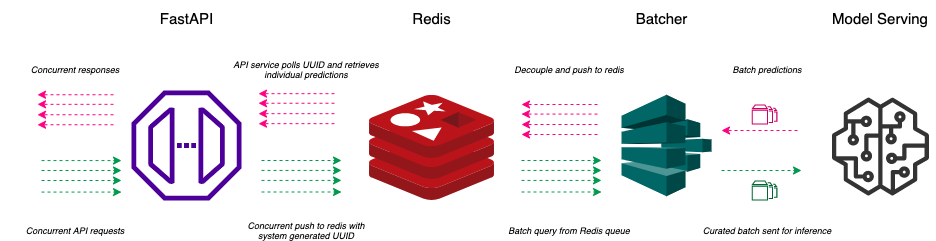

# Model Micro Batching

This repo helps us to micro-batch concurrent API requests and inference them in a single shot.

Technologies used
- FastAPI
- Redis

## Architecture

API Collects the request, creates a uuid for request and pushes to redis.
Batcher reads the redis queue, stacks the data into micro-batches and sends for model inferencing
The results are decoupled and pushed back to redis
The API function polls redis db every X seconds to check if results are published
Once results are available they are sent back to client

Diagram 



## Usage

Start your model service (TF-Serving/ other model APIs) if any

Start redis server 
```
docker run -d -p 6379:6379 redis
```

Start batcher service 
```
python batcher.py
```

Start API 
```
uvicorn api:app
```

## Benchmark 
Set the below conditions to mimic real-world times
- Image decode time = 0.5 seconds
- 1 inference = 0.5 seconds
- Batch size of model = 5

#### 1 API worker, 1 Batch processor - model combo

Average times :
- 1 Image - 1.07 seconds
- 10 Images - 2.26 seconds
- 50 Images - 7.49 seconds
- 100 Images - 12.72 seconds
- 200 Images - 25.1 seconds


#### 1 API worker, 2 Batch processor - model combo

Average times:
- 1 Image - 1.07 seconds 
- 10 Images - 1.67 seconds 
- 50 Images - 4.05 seconds 
- 100 Images - 7.18 seconds 
- 200 Images - 13.00 seconds

## Concerns/ Test points
- Error Handling
- Redis db sanity when multiple batcher processes run 